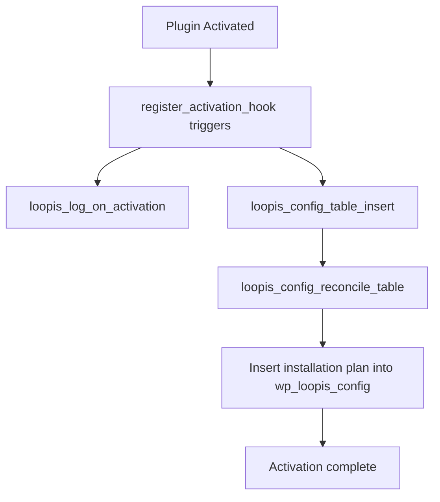
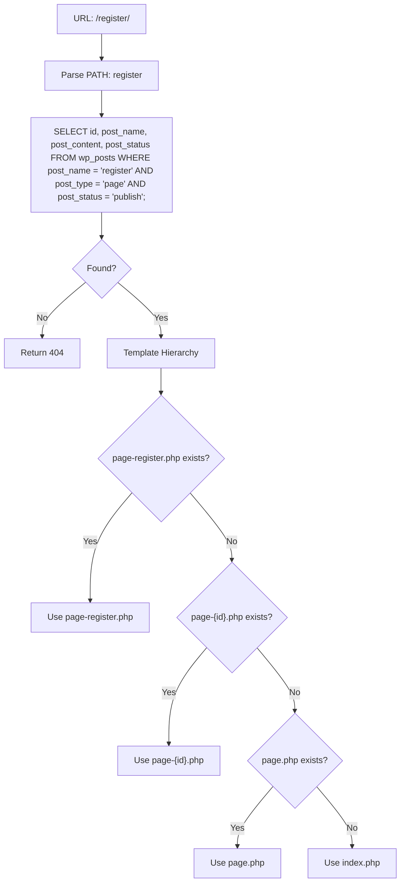

# 🧑‍💻 Development guide
**How to get started.**

This guide is designed for developers who are new to PHP and WordPress. It provides an overview of the LOOPIS project structure, essential WordPress concepts, and debugging setup to help you get started quickly.

## Table of Contents

- [Prerequisites](#prerequisites)
- [Repository Overview](#repository-overview)
- [WordPress Basics](#wordpress-basics)
- [Debugging Setup](#debugging-setup)
- [loopis-config Deep Dive](#loopis-config-deep-dive)
- [loopis-admin Deep Dive](#loopis-admin-deep-dive)
- [loopis-theme Deep Dive](#loopis-theme-deep-dive)

## Prerequisites

Follow the guide [Local setup of LOOPIS.app](https://github.com/LOOPIS-app/.github/blob/main/resources/local-setup.md) to install and run LOOPIS locally.

## Repository Overview

LOOPIS consists of several repositories, each serving a specific purpose:

| Repository | Type | Description |
|------------|------|-------------|
| [loopis-config](https://github.com/LOOPIS-app/loopis-config) | Plugin | Central configuration management - initializes database tables, manages plugins and themes |
| [loopis-admin](https://github.com/LOOPIS-app/loopis-admin) | Plugin | Adds Locker management menu and functionality to WordPress admin dashboard |
| [loopis-theme](https://github.com/LOOPIS-app/loopis-theme) | Theme | Custom WordPress theme for LOOPIS |

## WordPress Basics

### Plugin Loading Mechanism

WordPress discovers plugins by scanning for files containing "Plugin Name: " in their header comments. This file serves as the plugin entry point. For example, in `loopis-config`, the entry point is `loopis-config.php`.

### Plugin Execution Model

Plugins register callbacks for various WordPress lifecycle events using built-in functions:

- `register_activation_hook` - Called when the plugin is activated
- `add_action` - Hooks into WordPress actions triggered during page loads

### Theme Loading Mechanism

WordPress discovers themes similarly to plugins. It looks for files containing "Theme Name: " in their header comments. For `loopis-theme`, this entry point is `style.css`.

## Debugging Setup

### Prerequisites

1. Enable Xdebug in the LocalWP client
2. Install the following VS Code extensions:
   - PHP Debug
   - PHP Intelephense
   - WordPress Snippets (optional)

### VS Code Configuration

Create a `.vscode/launch.json` file in your project with the following content:

```json
{
    "version": "0.2.0",
    "configurations": [
        {
            "name": "Listen for Xdebug",
            "type": "php",
            "request": "launch",
            "port": 9003,
            "pathMappings": {
                "${env:HOME}/Local Sites/loopis/app/public/wp-content/plugins/loopis-config": "${workspaceFolder}/loopis-config"
            }
        }
    ]
}
```

**Note**: Adjust the `pathMappings` to match your LocalWP site path and the specific plugin/theme you want to debug.

### VS Code Settings for WordPress IntelliSense

To enable code completion and navigation for WordPress functions, configure your `.vscode/settings.json`:

```json
{
    "intelephense.environment.includePaths": [
        "/Users/your-username/Local Sites/loopis/app/public"
    ]
}
```

**Note**: 
- Adjust the path to match your LocalWP installation directory
- Unlike `.vscode/launch.json`, the `intelephense` extension does **not** support environment variables like `${env:HOME}`, so you must use the absolute path

This allows PHP Intelephense to recognize WordPress core functions, enabling:
- Click-to-navigate to WordPress function definitions
- Function signature tooltips and documentation
- Improved autocomplete suggestions

## Getting Started

After setting up your local environment:

1. Start by exploring the [loopis-config](https://github.com/LOOPIS-app/loopis-config) repository - it handles core initialization
2. Review the folder structure in each repository to understand the code organization
3. Use the debugging setup above to step through code and understand the flow

## loopis-config Deep Dive

**loopis-config** is the central configuration plugin that automates the entire LOOPIS WordPress installation process.

### Folder Structure

```
loopis-config/
├── loopis-config.php           # Main entry point
├── interface/                  # Admin menu registration
│   └── loopis_config_admin_menu.php
├── pages/                     # Admin page rendering
│   └── loopis_config_page.php
├── functions/
│   ├── loopis_config_functions.php    # AJAX handlers
│   ├── loopis_db_setup.php           # Main setup orchestrator
│   └── db-setup/                     # Individual setup functions
│       ├── loopis_config_table.php   # Config table management
│       ├── loopis_settings.php       # Settings table
│       ├── loopis_lockers.php        # Lockers table
│       ├── loopis_pages.php          # Page creation
│       ├── loopis_cats.php           # Category creation
│       ├── loopis_roles.php          # User roles
│       ├── loopis_external_plugins.php  # WordPress.org plugins
│       └── loopis_internal_components.php # LOOPIS plugins/themes
├── assets/
│   ├── js/loopis_config_buttons.js   # Frontend installer logic
│   └── css/
└── logging/
```

### Database Tables Created

loopis-config creates the following custom tables:

| Table | Purpose |
|-------|---------|
| `wp_loopis_config` | Installation plan and status tracking |
| `wp_loopis_settings` | LOOPIS application settings |
| `wp_loopis_lockers` | Locker management data |

### Activation Flow

When you activate the loopis-config plugin, it follows this sequence:



1. **Activation hooks** (`loopis-config.php:109,118-122`):
   - `loopis_log_on_activation()` - Logs activation to `logs/php/error.log`
   - Creates `wp_loopis_config` table and inserts installation plan

2. **Installation plan** (`functions/db-setup/loopis_config_table.php`):
   - `loopis_config_get_table()` returns all components to be installed
   - `loopis_config_reconcile_table()` syncs this plan to the database

### Installation Categories

The `wp_loopis_config` table has three categories:

| Category | Description | Examples |
|----------|-------------|----------|
| `Initialization` | Core plugin itself | loopis-config |
| `Install` | LOOPIS plugins, themes, and DB setup | loopis-admin, loopis-theme, loopis_settings_create, loopis_settings_insert, loopis_lockers_create, etc. |
| `Component` | External WordPress.org plugins | Post SMTP, WP Statistics, etc. |

### Management Page Code Reading Path

To understand how the management page works, follow this reading order:

1. **`loopis-config.php`** - Entry point registers the admin menu:
   ```php
   add_action('admin_menu', 'loopis_config_admin_menu');
   ```

2. **`interface/loopis_config_admin_menu.php`** - `loopis_config_admin_menu()` creates the menu item and links it to the page callback

3. **`pages/loopis_config_page.php`** - `loopis_config_page()` renders the HTML table showing installation status

4. **`pages/loopis_config_page.php`** - `loopis_config_enqueue_scripts()` loads JavaScript and passes data to frontend:
   ```php
   wp_localize_script('loopis_config_buttons_js', 'loopis_ajax', [
       'setup_functions' => $setup_functions,
       'preinstall_data' => $preinstall_data,
       // ...
   ]);
   ```

5. **`assets/js/loopis_config_buttons.js`** - Handles button clicks, AJAX requests, and status updates

### Management Page Architecture

The LOOPIS Config admin page follows WordPress AJAX patterns. Here's how data flows between frontend and backend:

**Data Flow:**

```
Database (wp_loopis_config)
         ↓
PHP (loopis_config_page.php)
         ↓
wp_localize_script('loopis_ajax', { setup_functions, preinstall_data, ... })
         ↓
JavaScript (loopis_config_buttons.js)
         ↓
AJAX POST → admin-ajax.php → loopis_sp_handle_actions()
         ↓
Dynamic function call (e.g., loopis_components_install)
         ↓
Update wp_loopis_config status
```

**Frontend entry:** `assets/js/loopis_config_buttons.js`

| Function | Purpose |
|----------|---------|
| `installButton()` | Main entry - runs `installPlugins()` and `stepFunction(0)` in parallel |
| `installPlugins()` | Installs WordPress.org plugins (Category: Component) |
| `stepFunction()` | Executes installation steps sequentially (Category: Install) |

**Backend router:** `functions/loopis_config_functions.php`

| Function | Purpose |
|----------|---------|
| `loopis_sp_handle_actions()` | Receives AJAX requests, calls functions dynamically by `func_step` parameter |
| `loopis_sp_activate_plugins_handler()` | Called after installation completes, activates all installed plugins |

**How it works:**

1. **Page load**: PHP reads `wp_loopis_config` table and passes data to JavaScript via `loopis_ajax` object

2. **User clicks "Install"**:
   - `installPlugins()` runs in parallel → installs WordPress.org plugins via `plugins_api()`
   - `stepFunction(0)` runs in parallel → executes `loopis_settings_create`, `loopis_components_install`, etc.

3. **Each step**: AJAX calls `admin-ajax.php` with `func_step` parameter → PHP dynamically calls that function → returns JSON status

4. **After completion**: Form submits to `admin-post.php` → `loopis_sp_activate_plugins_handler()` → activates all plugins

### Key Installation Functions

| Function | Location | What it does |
|----------|----------|--------------|
| `loopis_ext_plugins_install()` | `db-setup/loopis_external_plugins.php` | Downloads plugins from WordPress.org using `Plugin_Upgrader` |
| `loopis_components_install()` | `db-setup/loopis_internal_components.php` | Downloads and activates LOOPIS plugins from GitHub using `Plugin_Upgrader` |
| `loopis_themes_configure()` | `db-setup/loopis_internal_components.php` | Downloads and activates LOOPIS theme from GitHub |
| `loopis_plugins_activate()` | `db-setup/loopis_external_plugins.php` | Activates all installed plugins from WordPress.org and sets plugin options |

## loopis-admin Deep Dive
**loopis-admin** provides Locker management features in the WordPress admin:

- `interface/` - Handles menu routing and admin interface setup
- `pages/` - Contains the actual page content and functionality

## loopis-theme Deep Dive

**loopis-theme** is a WordPress theme. A WordPress instance can have multiple plugins installed and active, but can only have one theme installed and active.

The **loopis-theme** module covers essentially all frontend user-facing functionality of LOOPIS. The following analysis is organized by page and feature.

One important note: **loopis-theme** relies on WordPress core mechanisms as well as plugins like WP User Manager. When you encounter confusing code logic, consider looking at these aspects.

### Folder Structure

```
loopis-theme/
├── front-page.php              # Homepage template
├── page.php                    # Generic page template
├── page-*.php                  # Custom page templates (register, submit, etc.)
├── header.php                  # Site header (navigation, meta tags)
├── footer.php                  # Site footer (bottom navigation menu)
├── functions.php               # Theme bootstrap and initialization
├── search.php                  # Search results template
├── single.php                  # Single post template
├── templates/                  # Reusable template parts
│   ├── user/front-page/       # Front page sections by user state
│   │   ├── front-alerts.php   # Notifications for logged-in members
│   │   ├── front-forum.php    # Forum posts display
│   │   ├── front-message.php  # Welcome/status messages
│   │   └── add-to-homescreen.php  # iOS PWA prompt
│   ├── access/message.php      # Access restriction messages
│   ├── faq/                   # FAQ-related templates
│   └── post-list/             # Post listing templates
├── pages/                      # Dynamic content loaders
│   ├── submit/                # Submit page sub-pages
│   └── discover/              # Discover page sub-pages
├── includes/                   # Theme functionality
│   ├── functions/everyone/    # Functions available to all users
│   ├── functions/user/        # Functions for logged-in users
│   └── features/              # Feature modules
└── assets/                    # CSS, JS, fonts, images
```

### Database Connection for Development

When analyzing the theme code, connecting to the WordPress MySQL database helps understand how data flows through the application.

LocalWP provides a Site Shell feature that opens a pre-configured shell environment. Within the Site Shell, you can connect to the database using:

```bash
wp db cli
```

This method is more convenient for running quick SQL queries during development compared to LocalWP's web-based AdminNeo database manager.

### WordPress Page Routing

LOOPIS uses different routing mechanisms depending on the page type. Understanding this helps trace code execution.

#### Standard Page Routing

For most pages (e.g., `/register/`, `/submit/`), WordPress follows this sequence:



The above describes the routing rules for standard pages. However, WordPress also has special routing mechanisms for certain pages like the homepage and search pages, which are covered below when encountered.

### Homepage
1. The homepage URL when running locally with LocalWP is [http://loopis.local/](http://loopis.local/).
2. The homepage routing is configured in WordPress [Dashboard](http://loopis.local/wp-admin/options-reading.php) under Settings: Reading → Your homepage displays → Homepage. The corresponding database query is:

```sql
select id, post_name, post_content, post_status from wp_posts where id = (select option_value from wp_options where option_name = 'page_on_front');
```

Don't worry if this step is confusing - you can skip it for now.

3. The homepage template file is front-page.php. This file includes header.php and footer.php, so reading these three files gives you a complete understanding of the homepage functionality.

### Registration Page
1. The registration page URL when running locally with LocalWP is [http://loopis.local/register](http://loopis.local/register).
2. The user system uses the WP User Manager plugin, which is affected by WordPress Multisite settings. By default, registration is disabled. To enable it, go to [Dashboard](http://loopis.local/wp-admin/network/settings.php): Network Admin → Settings → Registration Settings
3. The registration page follows the standard page routing rules, so the corresponding template is `page-register.php`. The core line is:

```php
<?php echo do_shortcode('[wpum_register form_id="1"]'); ?>
```

This shortcode leverages the WP User Manager plugin to:

- Display the registration form (GET request)
- Process registration (POST request)
- Show registration results (GET request)

### Login Page
1. The login page URL when running locally with LocalWP is [http://loopis.local/log-in](http://loopis.local/log-in).
2. The login page follows the standard page routing rules, so the corresponding template is `page.php`. The core line is `<?php the_content(); ?>`. This function first queries the `post_content` from the database (equivalent SQL: `SELECT id, post_name, post_content, post_status FROM wp_posts WHERE post_name = 'log-in';`), then renders it using shortcode functionality (similar to the registration page) to leverage the WP User Manager plugin for:

- Displaying the login form (GET request)
- Processing login (POST request)
- Showing login results (GET request)

3. Upon successful login, the user is redirected to the default WP User Manager success page. The corresponding template is located at `wp-content/plugins/wp-user-manager/templates/already-logged-in.php`.

### Search Page

1. The search page URL when running locally with LocalWP is [http://loopis.local/?s=](http://loopis.local/?s=).
2. The search functionality is a WordPress core feature, so the search page does not follow the standard page routing rules. The corresponding template is `search.php`.

### Submit Page

1. The submit page URL when running locally with LocalWP is [http://loopis.local/submit/](http://loopis.local/submit/).
2. The submit page follows the standard page routing rules, so the corresponding template is `page-submit.php`.

### FAQ Page

1. The FAQ page URL when running locally with LocalWP is [http://loopis.local/faq/](http://loopis.local/faq/).
2. The FAQ page follows the standard page routing rules, so the corresponding template is `page-faq.php`.
